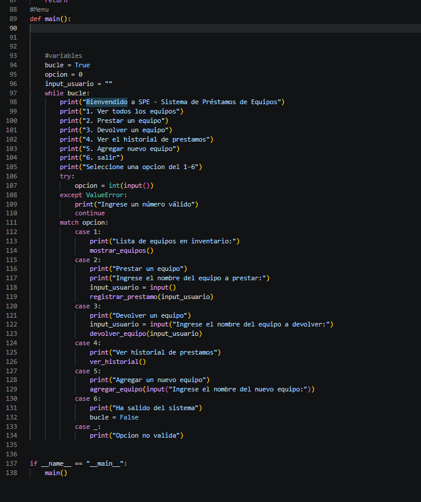
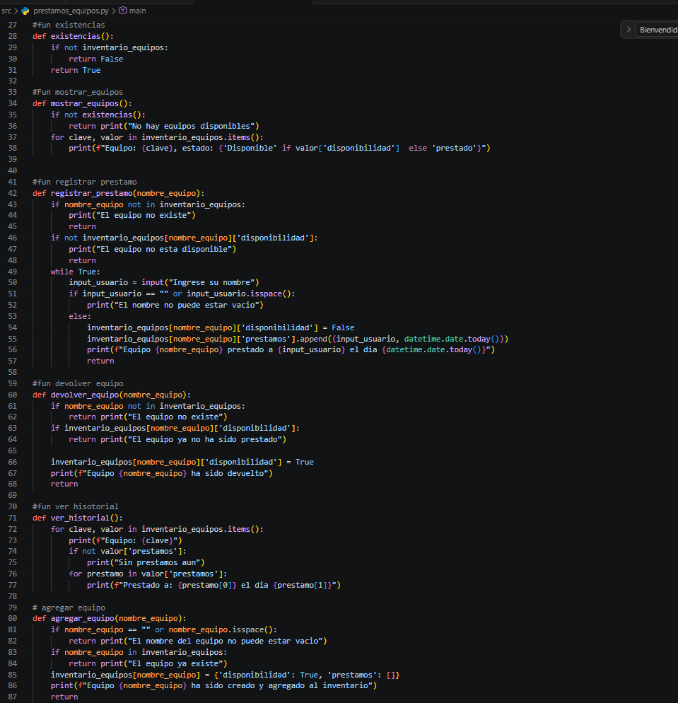
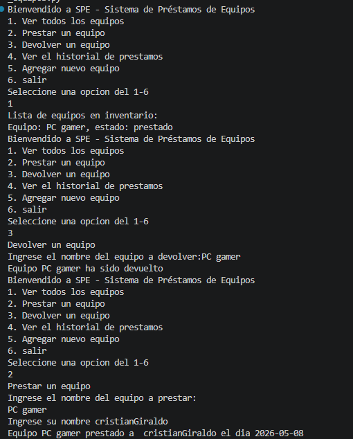
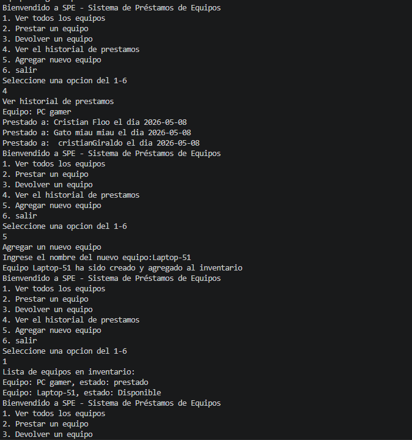
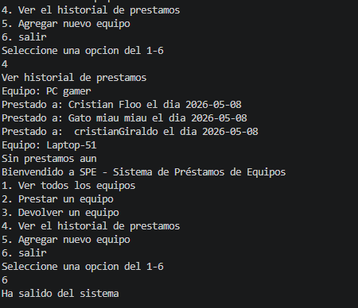

# Sistema de Préstamos de Equipos (SPE)

Sistema interactivo por terminal que permite gestionar préstamos de equipos. Desarrollado en Python con un menú de 6 opciones: ver inventario, prestar equipos, devolver equipos, ver historial de préstamos, agregar nuevos equipos y salir.

## Estructura del código

### Menú principal

En esta imagen se ve el bucle principal del programa. Un `while` que muestra las 6 opciones del menú, valida la entrada con `try`/`except` para evitar errores si se ingresa texto en lugar de un número, y usa `match`/`case` para ejecutar la función correspondiente según la opción seleccionada.

### Funciones del sistema

Aquí están las funciones modulares que realizan cada operación:

- **`mostrar_equipos()`** — Recorre el diccionario `inventario_equipos` y muestra cada equipo con su estado (Disponible / Prestado).
- **`registrar_prestamo(nombre_equipo)`** — Verifica que el equipo exista y esté disponible, luego registra el préstamo con el nombre del usuario y la fecha actual.
- **`devolver_equipo(nombre_equipo)`** — Verifica que el equipo exista y esté prestado, luego cambia su disponibilidad a `True`.
- **`ver_historial()`** — Muestra todos los préstamos registrados para cada equipo.
- **`agregar_equipo(nombre_equipo)`** — Agrega un nuevo equipo al inventario con disponibilidad `True` y una lista vacía de préstamos.

Todas las funciones trabajan sobre un diccionario principal `inventario_equipos`, donde cada equipo tiene un diccionario con su disponibilidad y una lista de tuplas (usuario, fecha) como historial de préstamos.

## Ejemplos de ejecución

### Test 1: Devolver y prestar un equipo

Se inicia viendo el inventario — "PC gamer" aparece como **prestado**. Luego se devuelve: la disponibilidad cambia a `True`. Finalmente se presta a "cristianGiraldo": la disponibilidad vuelve a `False` y se agrega una nueva tupla `("cristianGiraldo", 2026-05-08)` al historial.

### Test 2: Historial y agregar equipo

Se consulta el historial de "PC gamer" donde aparecen 3 préstamos registrados (Cristian Floo, Gato miau miau y cristianGiraldo). Luego se agrega "Laptop-51" al inventario con disponibilidad `True` y lista de préstamos vacía.

### Test 3: Historial actualizado

Se vuelve a consultar el historial y ahora aparecen ambos equipos: "PC gamer" con sus 3 préstamos y "Laptop-51" con **Sin préstamos aún**. Finalmente se selecciona la opción 6 y se sale del sistema.

## Reflexión personal

Cuando estaba mirando los requisitos y sobre todo cómo guardar la estructura de datos, había hecho la estructura en 3 partes: diccionario, lista y tupla. Leyendo y enfrentándome a problemas de diseño, volví a leer el documento y al comprender que el diccionario es la columna vertebral de toda la estructura de datos, todo fue más fácil.

Leer, analizar y comprender los requisitos y ayudas es muy importante para tener un desarrollo ágil y tranquilo.

## Conclusiones

El proyecto permitió aplicar conceptos fundamentales de Python como diccionarios anidados, listas, tuplas, funciones modulares, manejo de excepciones y estructuras de control. La clave del desarrollo fue entender bien la estructura de datos antes de escribir el código, lo que evitó retrabajo y facilitó la implementación de cada funcionalidad.
