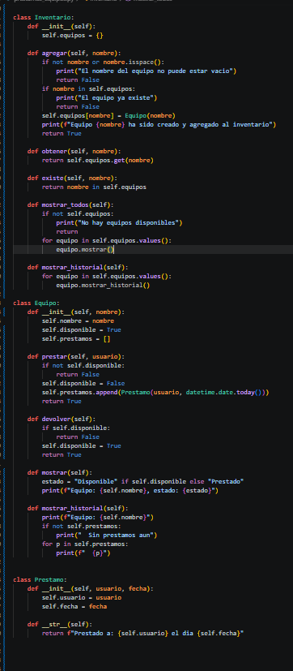
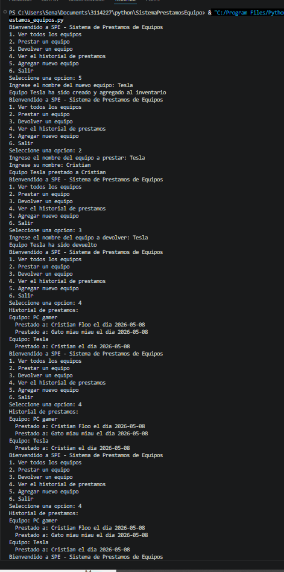

# Sistema de Préstamos de Equipos (SPE)

Sistema interactivo por terminal que permite gestionar préstamos de equipos. Desarrollado en Python con programación orientada a objetos y un menú de 6 opciones: ver inventario, prestar equipos, devolver equipos, ver historial de préstamos, agregar nuevos equipos y salir.

## Estructura del código

### Las clases



El código se organiza en 3 clases que se componen entre sí:

- **`Prestamo`** — Representa un préstamo individual. Tiene dos atributos: `usuario` (string) y `fecha` (date). Su método `__str__` permite mostrarlo fácilmente con `print()`.

- **`Equipo`** — Representa un equipo del inventario. Tiene `nombre`, `disponible` (bool) y una lista `prestamos` que almacena objetos `Prestamo`. Sus métodos (`prestar()`, `devolver()`, `mostrar()`, `mostrar_historial()`) le permiten gestionar su propio estado sin necesidad de funciones externas.

- **`Inventario`** — Administra la colección de equipos usando un diccionario donde la clave es el nombre del equipo y el valor es el objeto `Equipo`. Sus métodos (`agregar()`, `obtener()`, `mostrar_todos()`, `mostrar_historial()`) reemplazan las funciones sueltas del enfoque procedural.

**Relación**: `Inventario` contiene muchos `Equipo`, y cada `Equipo` contiene muchos `Prestamo`.

### El menú principal


El menú sigue siendo un bucle `while` con 6 opciones y validación `try`/`except`, pero ahora en vez de llamar funciones sueltas que modifican un diccionario global, usa los métodos de los objetos:

- `inventario.mostrar_todos()` en vez de `mostrar_equipos()`
- `equipo.prestar(usuario)` en vez de `registrar_prestamo(nombre)`
- `equipo.devolver()` en vez de `devolver_equipo(nombre)`
- `inventario.mostrar_historial()` en vez de `ver_historial()`
- `inventario.agregar(nombre)` en vez de `agregar_equipo(nombre)`

## Creación de objetos inline

Una diferencia clave con la programación procedural es cómo se crean los objetos. En lugar de hacer:

```python
nuevo_prestamo = Prestamo("Ana", fecha)
self.prestamos.append(nuevo_prestamo)
```

se hace directamente:

```python
self.prestamos.append(Prestamo("Ana", fecha))
```

El objeto `Prestamo` se crea y se pasa al método `.append()` sin guardarlo en una variable intermedia. Es azúcar sintáctica: funciona igual, pero ahorra una línea. Pasa lo mismo al crear `Equipo("Tesla")` dentro de `agregar()`.

## Ejemplo de ejecución



El flujo completo del sistema:

1. Se agrega "Tesla" al inventario
2. Se presta "Tesla" a "Cristian"
3. Se devuelve "Tesla"
4. Se consulta el historial: aparecen "PC gamer" con 2 préstamos y "Tesla" con 1
5. Se vuelve a consultar el historial (confirmación)
6. Se listan los equipos: "PC gamer" aparece como **Prestado** y "Tesla" como **Disponible**

## Reflexión personal

Al principio pensaba POO como algo más complicado de lo que realmente es. Entender que una clase es simplemente una plantilla que define atributos (datos) y métodos (comportamiento), y que los objetos son instancias con vida propia, fue clave. La parte más tricky fue la creación inline de objetos sin asignarlos a una variable, pero una vez que entendés que `Prestamo("Ana", fecha)` devuelve el objeto listo para usar, todo fluye.

## Conclusiones

El proyecto permitió aplicar conceptos fundamentales de Python como clases, objetos, encapsulamiento, composición y métodos. La refactorización de procedural a POO hizo el código más organizado: cada clase tiene una responsabilidad clara y los datos no están expuestos en un diccionario global. La clave del desarrollo fue entender la relación entre las clases (Inventario → Equipo → Préstamo) antes de escribir el código.
